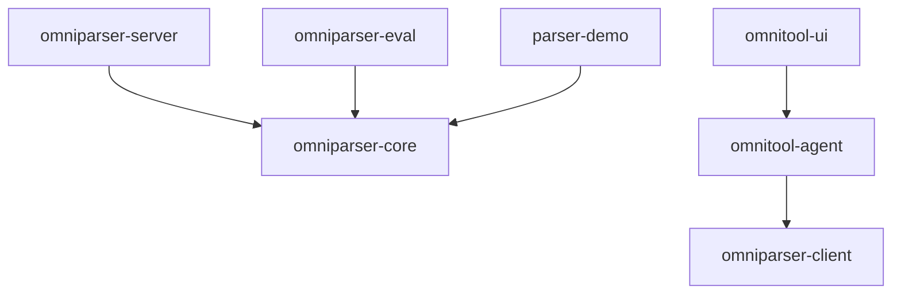

# Architecture

This page describes the package boundaries, dependency graph, and build system that hold the monorepo together.

## Layout

```
omniparser-fork/
├── packages/
│   ├── omniparser-core/        # Pure inference library
│   ├── omniparser-client/      # Typed HTTP client for omniparser-server
│   ├── omniparser-server/      # FastAPI service wrapping omniparser-core
│   ├── omniparser-eval/        # ScreenSpot-Pro grounding benchmarks
│   └── omnitool-agent/         # VLM agent loop (consolidated from upstream/omnitool/)
├── apps/
│   ├── parser-demo/            # Single-page Gradio demo
│   └── omnitool-ui/            # Reorganized Gradio agent UI
├── docs/                       # mkdocs-material site (this site)
├── upstream/                   # Pinned reference clone (b0d5c9f5, read-only)
├── .github/
│   ├── workflows/              # CI / security / docs / release / opencode
│   └── dependabot.yml          # Weekly uv + github-actions update PRs
├── pyproject.toml              # Workspace root (virtual; not installed)
└── uv.lock                     # Resolved lockfile across all members
```

## Dependency graph



- **`omniparser-core`** has no internal dependencies. It owns the inference pipeline (YOLO detection, caption, OCR, IoU dedup, annotation) and exposes `Omniparser`, `OmniparserConfig`, `ParseResult`, and `ParsedElement`.
- **`omniparser-server`** depends only on `omniparser-core` and FastAPI. It must remain a thin transport layer.
- **`omniparser-client`** is independent of `core`/`server` at the type level: it talks HTTP and re-declares its own response models. This avoids forcing every client consumer to install the inference dependencies.
- **`omniparser-eval`** depends on `omniparser-core` for the `positive` grounding method only (which calls `Omniparser.parse(...)`); the `allow_negative` and `with_uncertainty` methods use the OpenAI API directly with raw screenshots.
- **`omnitool-agent`** consumes `omniparser-client` (HTTP) and never `omniparser-core` directly.

## Plugin architecture for ML extras

The detection, captioning, and OCR backends in `omniparser-core` are defined as `Protocol`s. Each backend lives behind a lazy import:

```python
# packages/omniparser-core/src/omniparser/detection.py
class Detector(Protocol):
    def predict(
        self,
        image: ImageInput,
        *,
        box_threshold: float,
        iou_threshold: float = 0.7,
        imgsz: int | None = None,
    ) -> DetectionResult: ...
```

This means:

1. `mypy --strict` passes even when `torch` / `ultralytics` / `transformers` aren't installed (they're declared `ignore_missing_imports` in the workspace config).
2. Consumers can swap implementations — for example, an ONNX detector — without touching the pipeline.
3. Heavy deps are loaded on first use, not at import time. A simple `from omniparser import Omniparser` does not import torch.

## Build system: `uv` workspaces

The workspace root `pyproject.toml` declares members and shared tool config. Every member is a regular PEP 621 project with its own `pyproject.toml`, `src/`, and `tests/`.

Commands you'll use day-to-day:

```bash
uv sync --all-packages --group dev    # install everything for development
uv build --all-packages               # build sdists + wheels for all 7 members
uv lock --check                       # verify lockfile is in sync
uv run pytest                         # workspace-wide test run
```

### Why `src/` layout

Forces test imports to go through the installed package (not relative paths), catching packaging bugs that flat layouts miss. Combined with `pytest --import-mode=importlib`, multiple `tests/` directories can coexist without `__init__.py` collisions.

### Why `package = false` at the root

The workspace root is **virtual** — it's a build-system harness, not an installable package. `[tool.uv]package = false` prevents `uv` from trying to wheel-build the root, which would fail because there's no `src/` there.

## Type checking strategy

`mypy --strict` runs against every `packages/*/src/` tree. Tests are typed loosely (`disallow_untyped_defs = false`) so spec readability wins over exhaustive annotations. The strictness is enforced in CI under the `typecheck` job.

ML libraries (`torch`, `ultralytics`, `transformers`, `easyocr`, `paddleocr`, `cv2`, `supervision`, `timm`, `einops`, `gradio`) are listed under `[[tool.mypy.overrides]]` with `ignore_missing_imports = true`. This is required because the plugin architecture imports them lazily inside functions and they may legitimately be absent on the typecheck box.

## Test taxonomy

| Marker | Purpose | Runs in CI |
|---|---|---|
| (none) | Fast unit tests, mocked I/O | yes (every push/PR) |
| `slow` | Requires model weights or GPU | no (manual / nightly) |
| `benchmark` | ScreenSpot-Pro and friends | no (opt-in via `--benchmark`) |

Network calls are mocked with [`respx`](https://lundberg.github.io/respx/) (HTTP) — no test makes a live network call. The OpenAI eval tests stub the entire `openai.OpenAI` client via `respx`, and the JSONL contract test uses `pytest.skip` when the `upstream/` submodule isn't checked out.

## CI matrix

The `ci` workflow runs four jobs:

1. **lint** — `ruff check` + `ruff format --check`
2. **typecheck** — `mypy --strict` on all five `src/` trees
3. **test** — `pytest` matrix over `{ubuntu, windows, macos}` × `{py3.11, py3.12}` (six runners)
4. **build** — `uv build --all-packages`, uploads `dist/` as an artifact

The `security` workflow runs CodeQL on push, PR, and weekly schedule, plus `dependency-review` on PRs. The `release` workflow fires on `v*.*.*` tags and creates a GitHub Release with auto-generated notes attached to the built wheels.

All third-party actions are pinned by **40-character commit SHA** (with the version as a comment) per supply-chain hygiene. Dependabot is configured to update both Python deps and Action SHAs weekly, grouped by minor/patch.

## Upstream pin

`upstream/` is a `git submodule` pinned to `b0d5c9f5701f7e2be4771872e6e928da77759df3` (OmniParser v2.0.1). It is:

- **Read-only** — never modified, never imported from `packages/*`
- **Excluded from the workspace build** via `[tool.uv.workspace] exclude = ["upstream"]`
- **Excluded from Dependabot** — `gitsubmodule` ecosystem has `open-pull-requests-limit: 0`
- A traceable reference for parity tests (e.g., the JSONL schema contract test reads `upstream/eval/logs_sspro_omniv2.json`)

When upstream releases a new version, bumping the pin is a deliberate human action, not an automated one.
